# Introduction: *the need of a patient-specific dosimetric calculation at voxel level in nuclear medicine*

## Dosimetry nowadays in clinics

* through virtual mathematical phantoms

* minor corrections on patient characteristics (mass, height, organ size, etc.)

\begin{center}
\includegraphics[height=.6\textheight]{imgs/phantom1.png} \hspace{2cm}
\includegraphics[height=.6\textheight]{imgs/phantom2.png}
\end{center}

## From diagnostic to therapy

**New times**

* the increasing number of nuclear medicine techniques

* the doses involved in different techniques

* the growth of nuclear medicine use in therapy procedures

\vspace{.5cm}
**Demands**
\vspace{.3cm}
\begin{center}
\fbox{\begin{minipage}{20em}
\centering
\textcolor{red}{{\bf more accurate dosimetric assessment} \\ {\bf both in tumor tissues and organs at risk}}
\end{minipage}}
\end{center}

## Dosimetric Nuclear Medicine methods

* **S-values**
  - \underline{Def:} Mean dose per unit cumulated activity
  - \underline{Res:} Organ, sub-organ, voxel

* **DPK convolution**
  - \underline{Def:} Radial distribution for mean dose around a point source
  - \underline{Res:} Voxel

* **Monte Carlo**
  - \underline{Def:} Monte Carlo radiation transport and delivered energy simulation
  - \underline{Res:} Organ, sub-organ, voxel

## Pros & Cons

* **S-values**
  - \underline{Pros:} standardized and fast calculation
  - \underline{Cons:} limited to specified regions, uncertainties can reach 30-40%
  
* **DPK convolution**
  - \underline{Pros:} fast calculation
  - \underline{Cons:} already not stablished for non-homogeneous media $\leftarrow$ \textcolor{red}{working on it!}
  
* **Monte Carlo**
  - \underline{Pros:} the most accurate calculation and the only one accepted for non-homogeneous media and complex geometries
  - \underline{Cons:} high computational cost $\leftarrow$ \textcolor{red}{working on hacking it!}

## Patient-specific dosimetry?

* **S-values:** only minor corrections can be made 

* \textcolor{white}{**DPK:** possible, limited for some regions (where there are no large density changes) and in progress solved when considering DPK performance in non-homogeneous media} 

* \textcolor{white}{**Monte Carlo:** the most accurate and precise}

## Patient-specific dosimetry?

* **S-values:** only minor corrections can be made \hspace{.2cm} {width=5mm}

* **DPK:** possible, limited for some regions (where there are no large density changes) and \textcolor{red}{in progress} solved when considering DPK performance in non-homogeneous media 

* \textcolor{white}{**Monte Carlo:** the most accurate and precise}

## Patient-specific dosimetry?

* **S-values:** only minor corrections can be made \hspace{.2cm} {width=5mm}

* **DPK:** possible, limited for some regions (where there are no large density changes) and \textcolor{red}{in progress} solved when considering DPK performance in non-homogeneous media \hspace{.2cm} {width=5mm}

* **Monte Carlo:** the most accurate and precise 

## Patient-specific dosimetry?

* **S-values:** only minor corrections can be made \hspace{.2cm} {width=5mm}

* **DPK:** possible, limited for some regions (where there are no large density changes) and \textcolor{red}{in progress} solved when considering DPK performance in non-homogeneous media \hspace{.2cm} {width=5mm}

* **Monte Carlo:** the most accurate and precise \hspace{.2cm} {width=5mm}

## Organ, sub-organ and voxel level?

In order to asses 3D patient-specific dosimetry it is desired to perform:

* sub-organ and/or voxelized resolution

* consider the actual mass/tissue distribution $\leftarrow$ CT, RMN

* take into account patient-specific real activty distribution $\leftarrow$ SPECT, PET

## The proposal

Design and development of a computational tool devoted to:

* compute dose delivery at voxel (or sub-organ) level with millimetric resolution

* consider the actual tissue patient distribution

* use the actual avtivity distribution and its time evolution

* integrate parameters for planar dosimetry nowadays in use

# DOSIS: *an integrated system for patient-specific dosimetry assessment at voxel level*

## DPK assessment

* performed by Monte Carlo simulations
  - photons, positrons and electrons $\leftarrow$ PENELOPE
  - alpha and others $\leftarrow$ FLUKA \textcolor{red}{in progress...}
  
* a model for estimating electrons DPK for different tissues have been developed\footnote{P. Pérez {\it et al.} Int. Journ. of Nucl. Med. Res. 3:45-55, 2016.}

* voxelized kernels generated from radial distributions obtained by Monte Carlo simulations

* capable of loading information from dual imaging techniques like PET-CT, SPECT-CT or SPECT-RMN

## DPK MC results: *validating*

\begin{figure}
\centering
\includegraphics[height=.31\textwidth]{imgs/dpk_validation.png}
\includegraphics[height=.31\textwidth]{imgs/dpk_validation_err.png}
\end{figure}

sDPK (F) calculated compared with published data\footnote{Botta et al. Med. Phys. 38(7):3944-3954.} (left) and uncertainties involved (right)

## DPK MC results: tissues

\begin{figure}
\centering
\includegraphics[height=.3\textwidth]{imgs/dpk_discriminacion.png}
\includegraphics[height=.3\textwidth]{imgs/dpk_tissues.png}
\end{figure}

sDPK (F) calculated discriminating primary and scattering contributions (left) and for different tissues (right)

## Application to internal dosimetry

**Voxel level dosimetry with DPK convolution**

* Activity distribution can be considered as an array of point sources

* Deposited dose distribution can be calculated by means of integration of all of these sources

* This can be made by the convolution technique

\begin{equation}
D(\vec{r}) = \mathbb{K}_{D}(\vec{r}) \ast \mathbb{A}_{cum}(\vec{r}) = \int_{-\infty}^{\infty} \mathbb{K}_{D}(\vec{r'}) \mathbb{A}_{cum}(\vec{r} - \vec{r'}) d\vec{r'}
\end{equation}

## Background theory

**Voxelizing**

* Defining $\mathcal{K}_D(i,j,k)$ and $\mathcal{A}_{cum}(i,j,k)$ as $\mathbb{K}_{D}(\vec{r})$ and $\mathbb{A}_{cum}(\vec{r})$ in 3D voxelized geometry

* Using Fourier Transform properties and convolution technique

* Dose $D(\vec{r})$ results

\begin{equation}
D(\vec{r}) = \mathbb{F}^{-1}\{\mathbb{F}\{\mathcal{K}_{D}(i,j,k)\} \cdot \mathbb{F}\{\mathcal{A}_{cum}(i,j,k)\}\}
\end{equation}

And both Matlab and Python (among others) provide libraries to a fast solve of this equation through Fast Fourier Transform algorithm.

# Graphical User Interface

## Chartflow

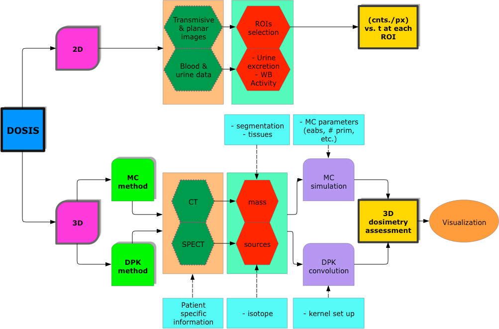

## Planar dosimetry chartflow

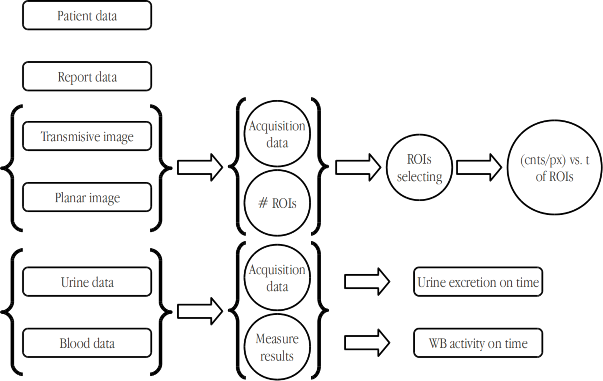

## Planar dosimetry GUI: *main*

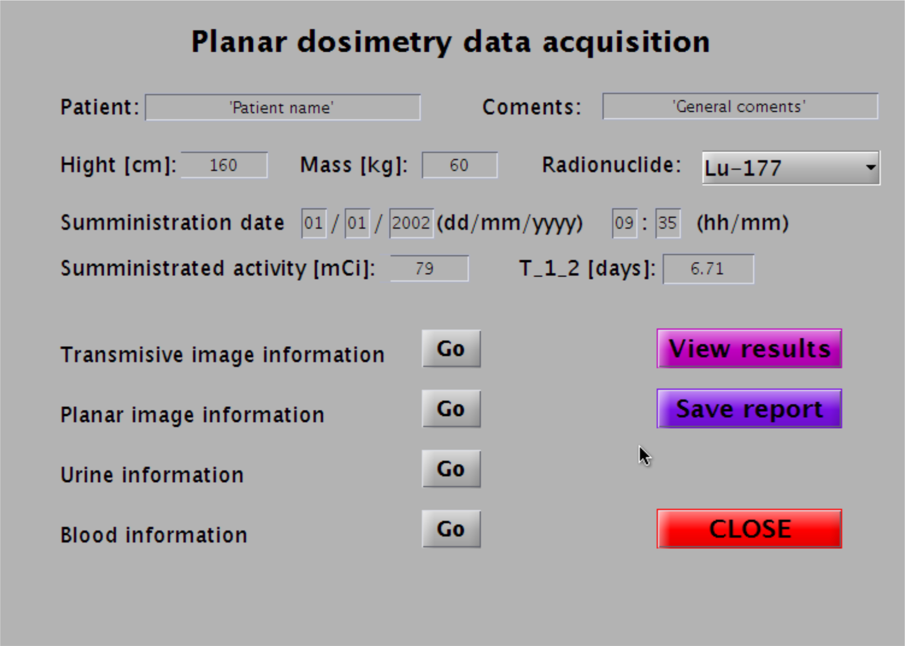

## Planar dosimetry GUI: *rois*

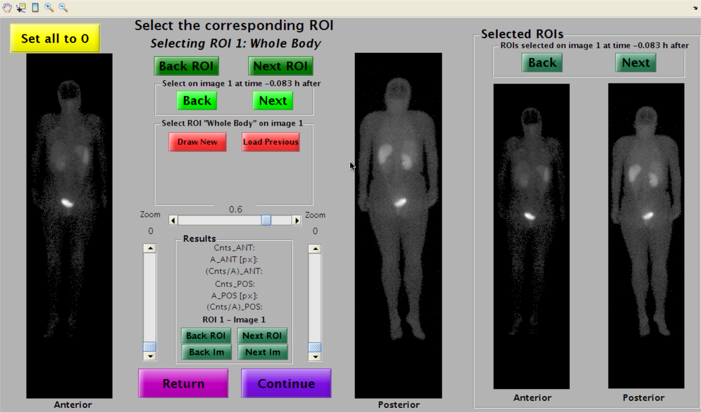

## Planar dosimetry GUI: *whole body*

\begin{center}
\includegraphics[height=.8\textheight]{imgs/planar-wb.png}
\end{center}

## Planar dosimetry GUI: *curves*

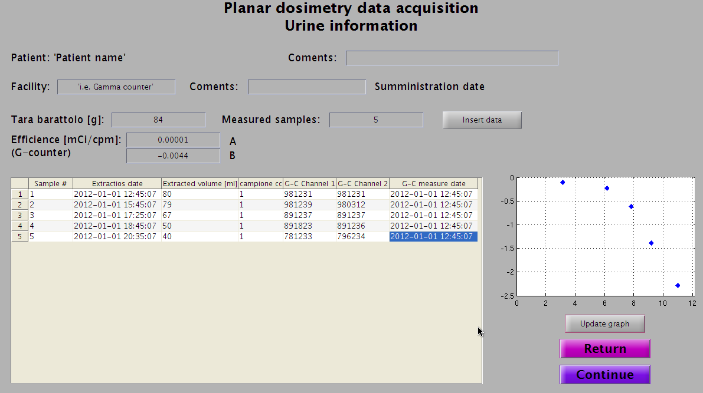

## 3D dosimetry chartflow

## 3D dosimetry: *GUI*

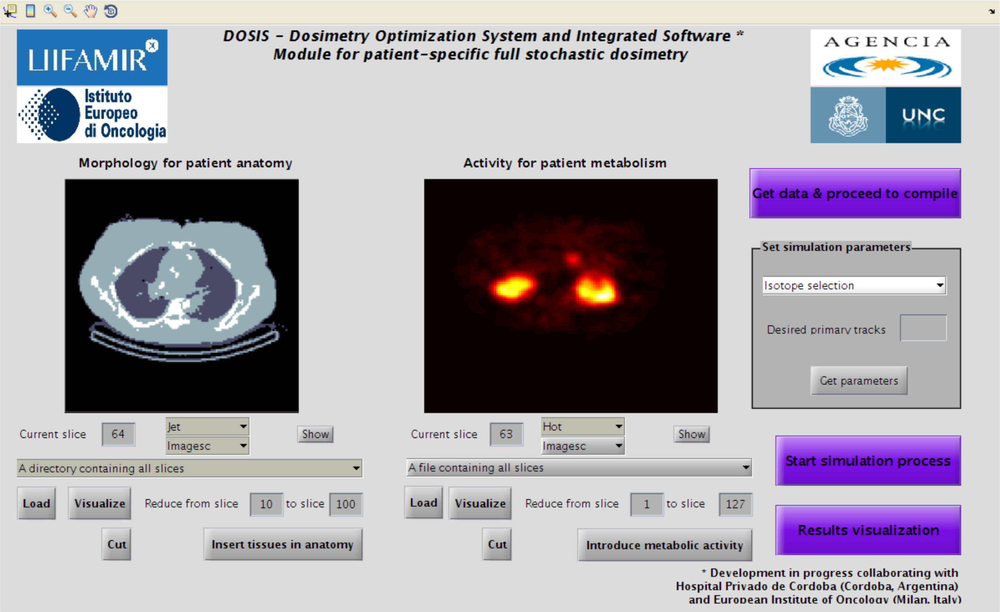

## 3D dosimetry: *segmentation*

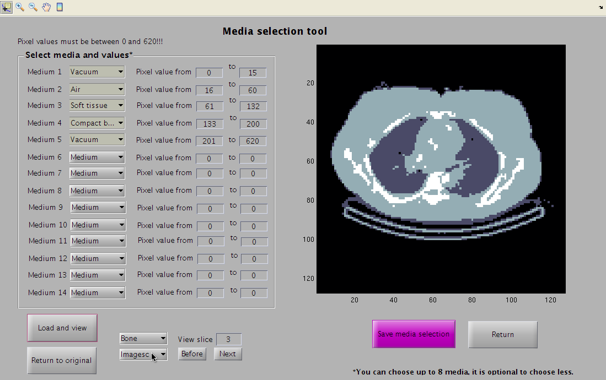

## 3D dosimetry: *visualization*

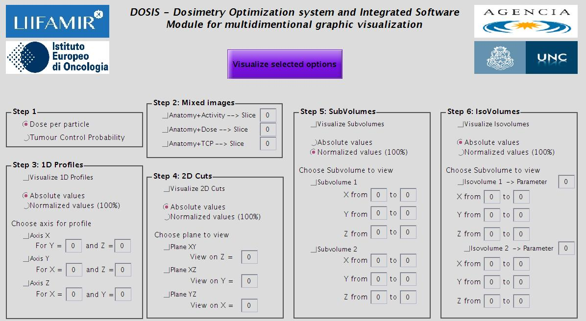

# Results

## Monte Carlo simulations

Comparison against bibliography on mathematical phantom

\begin{columns}
\begin{column}{.3\textwidth}
\begin{center}
\includegraphics[height=.8\textheight]{imgs/mc_comparison.png}
\end{center}
\end{column}
\begin{column}{.7\textwidth}
\begin{center}
\begin{tabular}{l c c}
\hline
Organ & Reference\footnote{Cherry, Sorenson \& Phelps. {\it Physics in Nuclear Medicine.}} & DOSIS \\
\hline
Liver & 1 & 1 \\
Adrenals & 0.13 & 0.47 \\
Brain & 0.00025 & 0.00083 \\
Stomach & 0.46 & 0.82 \\
Kidneys & 0.09 & 0.32 \\
Lungs & 0.064 & 0.082 \\
Pancreas & 0.12 & 0.41 \\
Spleen & 0.022 & 0.042
\end{tabular}
\end{center}
\end{column}
\end{columns}

## MC results on patient images

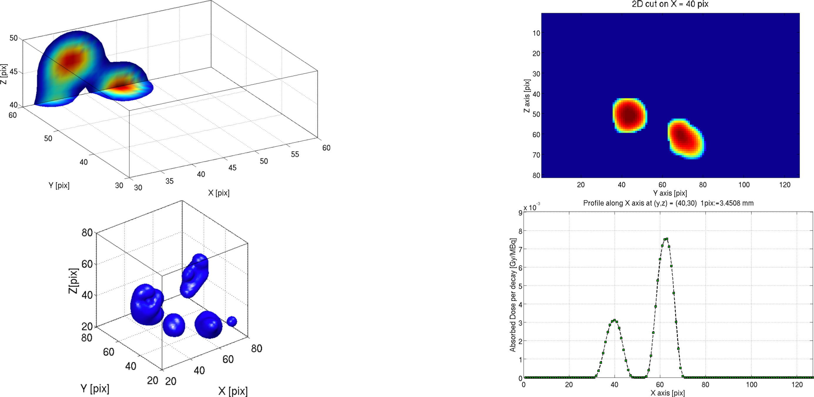

## DOSIS results

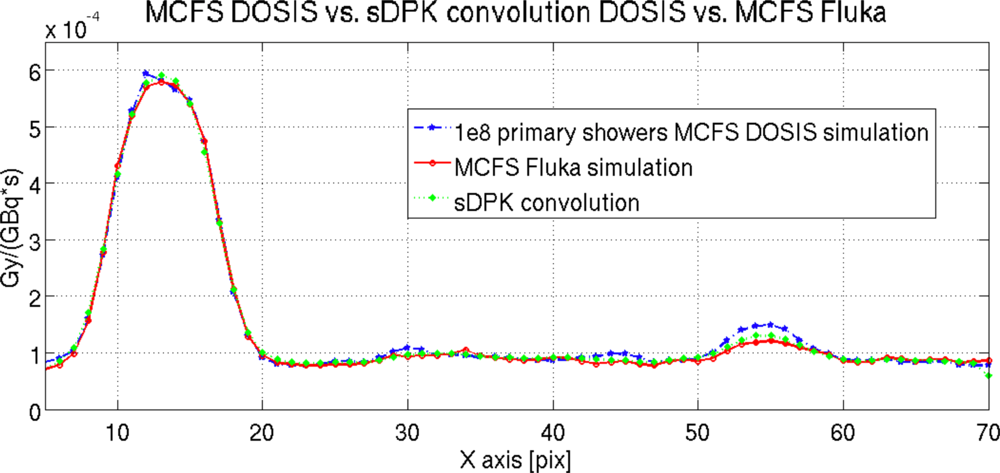

# Final considerations

## DOSIS today

* The developed tool is capable of perfoming planar dosimetry

* DOSIS is capable of assessing patient-specific 3D dosimetry at voxel level by means of MC simulations and DPK convolution

* The tool is now being implemented for different situations with colleagues from IEO (Milan) and University of Lund (Sweeden)
  - analyzing the effects of DPK convolutions when changing voxel size and activity distribution in image resolution
  - both DPK\footnote{Not yet implemented in GUI.} and MC calculations are being performed by DOSIS
  - results are expected to be sent for publication by the end of the year
  
## Uses: DPK

\begin{center}
\includegraphics[width=.32\textwidth]{imgs/now1.jpg}
\includegraphics[width=.32\textwidth]{imgs/now2.jpg}
\includegraphics[width=.32\textwidth]{imgs/now3.jpg}
\end{center}

\begin{center}
radioisotopes of $^{90}$Y, $^{131}$I and $^{177}$Lu
\end{center}

## Uses: MC

\begin{center}
\includegraphics[width=.75\textheight]{imgs/now4.png}
\end{center}

\begin{center}
3D enegy delivering on phantom
\end{center}

## Next Work 

* move to free languages like Python

* improve GUI and segmentation modules

* develope FLUKA implementation in order to add alpha emitters

* test the DOSIS with measurements and other calculation softwares

* include machine learning and deep learning techniques for supporting in segmentation and visualization

# Thanks!

## Visit us in Córdoba!

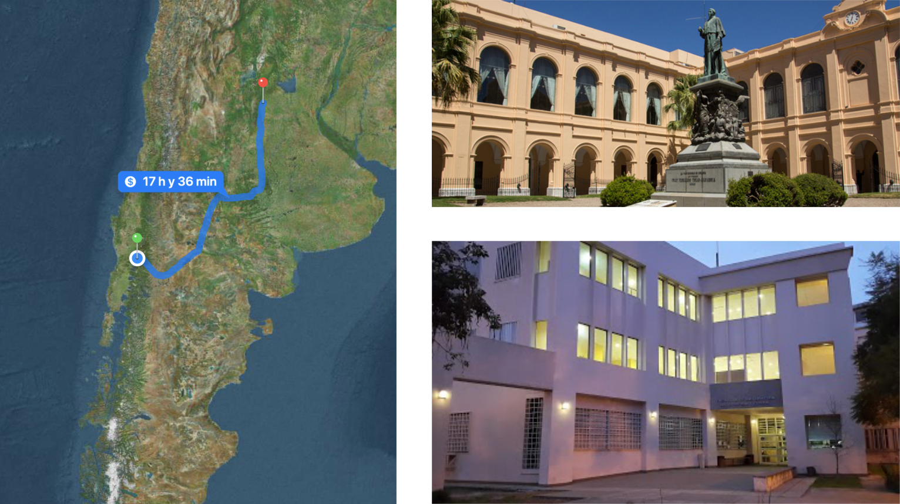

## Thanks for all!
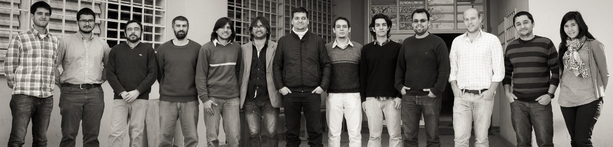

\begin{center}
www.liifamirx.famaf.unc.edu.ar\\
www.famaf.unc.edu.ar/$\sim$pperez1\\
\vspace{.5cm}
\footnotesize download this presentation from: github.com/pap84/oral-jfmf2018
\end{center}
